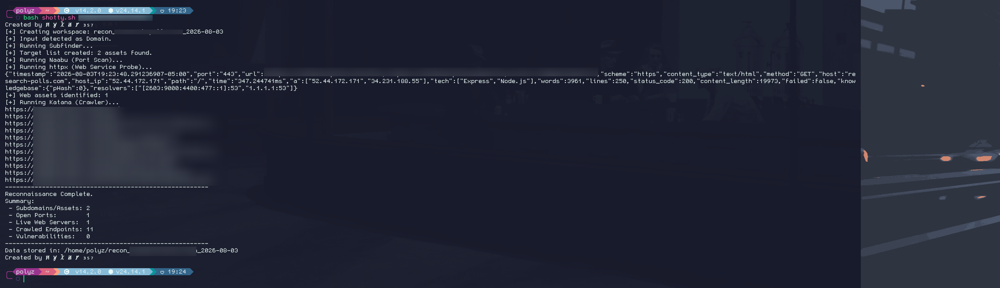
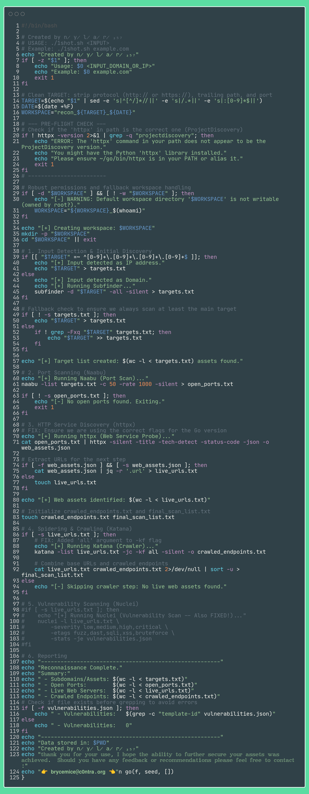

# XScraper - Recon Web Scraper

## New Release: `1shot.sh` - Rapid Reconnaissance and Asset Discovery
*(Legacy script XScrap remains available - Reconnoitre with your web scraper!)*

[](https://youtu.be/mkibO3xbN1w)

A suite of tools—now featuring `1shot.sh`—designed to gather publicly available information from specified web sources for cybersecurity intelligence, threat monitoring, and open-source intelligence (OSINT) gathering.

**Disclaimer:** This tool is intended for **educational and ethical purposes only**. Ensure you have explicit permission before scraping any website, respect `robots.txt`, and comply with all applicable laws and terms of service. The developers assume no liability and are not responsible for any misuse or damage caused by this tool.

---

## Table of Contents

- [Description](#description)
- [Purpose](#purpose)
- [Features](#features)
- [Technology Stack](#technology-stack)
- [Installation](#installation)
- [Usage](#usage)
- [Ethical Considerations](#ethical-considerations)
- [Contributing](#contributing)
- [License](#license)

---

## Description

This project provides configurable tools focused on extracting data relevant to cybersecurity professionals. 

The primary focus of this repository is now **`1shot.sh`**, a brand-new script designed for rapid, single-execution reconnaissance. It seamlessly strings together Project Discovery tools to map out target surfaces rapidly and efficiently without complex configurations.

The suite can still be adapted to monitor various online sources for indicators of compromise (IoCs), mentions of vulnerabilities, or other security-related keywords and patterns using the legacy Python scripts.



## Purpose

In the realm of cybersecurity, staying informed about emerging threats, vulnerabilities, and potential exposures is crucial. This tool aims to automate the collection of publicly accessible data from pre-defined sources to aid in:

*   **Automated Reconnaissance:** Quickly chaining CLI tools for immediate attack surface mapping and asset discovery.
*   **Threat Intelligence:** Identifying discussions or posts related to new threats, malware, or attack vectors.
*   **Vulnerability Monitoring:** Tracking mentions of specific CVEs or software weaknesses.
*   **OSINT Gathering:** Collecting public information related to specific domains, IPs, or organizations.

## Features

**New `1shot.sh` Capabilities:**
*   **High-Speed Execution:** Leverages `subfinder`, `httpx`, `katana`, and `naabu` to map out target surfaces efficiently.
*   **Optional Vulnerability Scanning:** Seamlessly integrates `Nuclei` for targeted, immediate vulnerability scanning directly within the workflow.
*   **Streamlined Extraction:** Automates the parsing of key web elements directly in your terminal.

**Legacy `XScrap` Capabilities:**
*   Allows for proxy usage, user agent customizing, web service enumeration, scraps robots.txt, site related emails, and sub-domain enumeration.
*   Searches for user-defined keywords, regular expressions, or patterns (e.g., CVE IDs, email formats, specific terms).
*   Extracts relevant text snippets or data points associated with matches.

## Technology Stack

*   **Core Reconnaissance:** Bash, Project Discovery tools (`subfinder`, `httpx`, `katana`, `naabu`, `nuclei`).
*   **Language:** Python 3.x (for legacy scraper).
*   **Core Libraries (Python):** `requests`, `BeautifulSoup4` or `lxml`, `dnspython`, `PySocks`.

## Installation

1.  **Clone the repository:**
    ```bash                                                                                                       
    git clone [https://github.com/nylar357/XScraper.git](https://github.com/nylar357/XScraper.git)                                                                                    
    cd XScraper                                                                                        
    ``` 
2.  **Install Project Discovery Dependencies (for `1shot.sh`):**
    Ensure you have Go installed, or download the pre-compiled binaries for `subfinder`, `httpx`, `katana`, `naabu`, and `nuclei` from the Project Discovery GitHub repository. Add them to your system path.
3.  **Install Python Dependencies (for legacy scripts):**
    ```bash
    python3 -m venv venv
    source venv/bin/activate
    pip install bs4 dnspython lxml PySocks requests
    ```

## Usage

**Primary Usage: `1shot.sh`**
Run the streamlined reconnaissance script directly against your authorized target:
```bash
./1shot.sh <target_domain>
